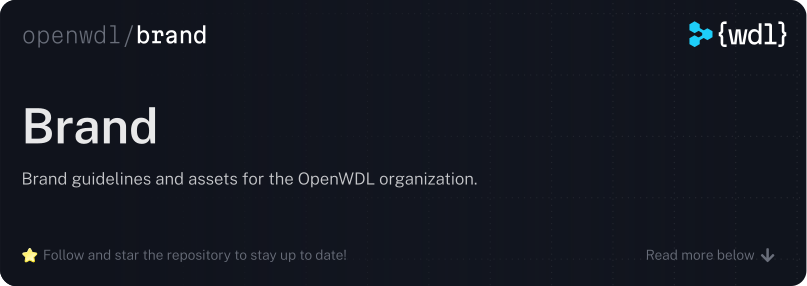

  

 

This repository holds the brand guidelines and a assets for the Workflow
Description Language and OpenWDL.

- Please refer to the [brand guidelines] on directions for how to use the logo
  and other brand assets.
- You will find individual assets underneath the `assets/` directory within this repository.

## License

The WDL specification is made available to you under the permissive [BSD
3-Clause License](./LICENSE).

© 2019-Present The OpenWDL Developers

[brand guidelines]: ./Guidelines.pdf
