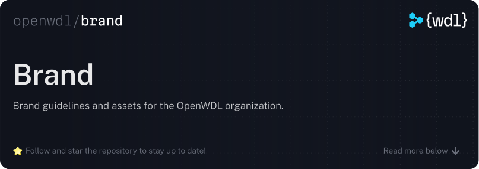

  

 

This repository holds the brand guidelines and a assets for the Workflow
Description Language and OpenWDL.

- Please refer to the [brand guidelines] on directions for how to use the logo
  and other brand assets.
- You will find individual assets underneath the `assets/` directory within this repository.

## License

This work is licensed under a
[Creative Commons Attribution 4.0 International License][cc-by].

[![CC BY 4.0][cc-by-image]][cc-by]

© 2019-Present The OpenWDL Developers

[cc-by]: http://creativecommons.org/licenses/by/4.0/
[cc-by-image]: https://i.creativecommons.org/l/by/4.0/88x31.png