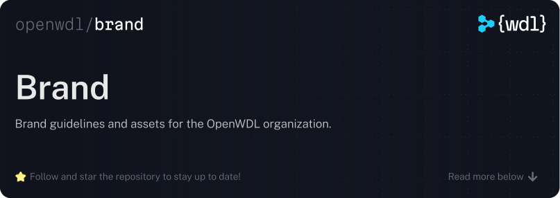

<div align="center">
  
</div>

This repository contains the OpenWDL brand guidelines, downloadable logo
assets, and the source for the brand website.

Visit the published guidelines at [brand.openwdl.org](https://brand.openwdl.org/).
The archived PDF is also available as [`brand-guidelines.pdf`](./brand-guidelines.pdf).

## Repository layout

- [`assets/`](./assets/) — SVG and PNG logo assets.
- [`site/`](./site/) — the React/Vite source for the published site.
- [`brand-guidelines.pdf`](./brand-guidelines.pdf) — archived PDF guidelines.

## Local development

The site requires Node.js 22 and npm. From the repository root:

```sh
cd site
npm ci
npm run dev
```

Useful commands from `site/`:

```sh
npm run lint   # Check source files
npm test       # Run the test suite
npm run build  # Copy assets and create a production build
```

Changes pushed to `main` run the test suite and deploy the site to GitHub Pages.
The deployment workflow can also be started manually from the repository's
Actions tab.

## License

Brand guidelines and assets are licensed under the
[Creative Commons Attribution 4.0 International License][cc-by].

[![CC BY 4.0][cc-by-image]][cc-by]

© 2019–Present The OpenWDL Developers

[cc-by]: https://creativecommons.org/licenses/by/4.0/
[cc-by-image]: https://i.creativecommons.org/l/by/4.0/88x31.png
